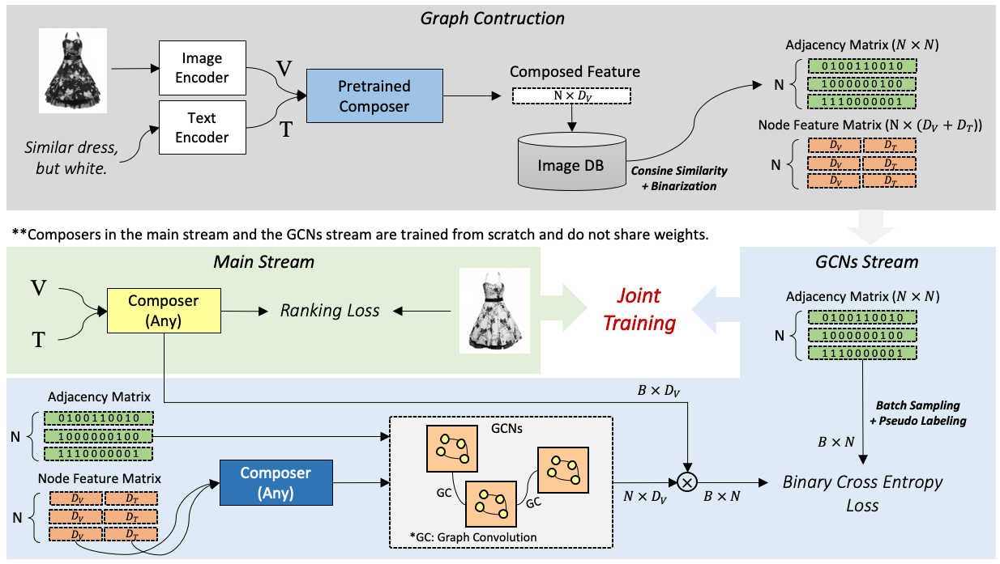

# RTIC: Residual Learning for Text and Image Composition using Graph Convolutional Network
This is the official code of RTIC: Residual Learning for Text and Image Composition using Graph Convolutional Network. The code only supports training and evaluation on FashionIQ. We release the implementations for the other baselines together.

## Updates
+ (2021.10.26) Update model checkpoints, trianing configs and tensorboard logs.
+ (2021.09.10) The official code is released.

## Requirements
Prepare your environment with virtualenv.
~~~
python3 -m virtualenv --python=python3 venv # create virtualenv.
. venv/bin/activate # activate environment.
pip3 install -r requirements.txt # install require packages.
~~~

## Download Data
We provide script for downloading FashionIQ images.
Note that it does not ensure that all images can be downloaded because we found some urls are broken.

~~~
sh script/download_fiq.sh
~~~

## Model Zoo
We provide pretrained checkpoints for RTIC / RTIC-GCN trained on FashionIQ.

Model | Recall | Checkpoint | Config | Training Log
-- | -- | -- | -- | --
RTIC | 39.22 | [ckpt](https://drive.google.com/file/d/13uvcT70Ak5jqiGzQMwLp86ddaxJpb63l/view?usp=sharing) | [config](https://drive.google.com/file/d/13AF82USF8COg7QcaoRqJ2Ph4lsK9Qohg/view?usp=sharing) | [tensorboard_log](https://drive.google.com/file/d/17Yd5J3sX4ppszxu53UxIQt5uNbeO8cNO/view?usp=sharing)
RTIC-GCN (scratch) | 39.55 | [ckpt](https://drive.google.com/file/d/1yCkcvbMteYTyQjYBL_n8ZjDpaPBmimOM/view?usp=sharing) | [config](https://drive.google.com/file/d/1MOaRoU-C29GkmStd6KI_CoYbSFakGgQn/view?usp=sharing) | [tensorboard_log](https://drive.google.com/file/d/1xZz1vXIMH7NHdrjLwsTOeAb0hQ9ki3ql/view?usp=sharing)
RTIC-GCN (finetune) | 40.64 | [ckpt](https://drive.google.com/file/d/1mIPYRXdTPfKjJyXIXrN7hFCRJy7APMGY/view?usp=sharing) | [config](https://drive.google.com/file/d/1daSTDbvf81cHFlU2j97rQ4_znXpGUjWU/view?usp=sharing) | [tensorboard_log](https://drive.google.com/file/d/1IyH4xso1hlvOfxi8mkTF5mrvkolvO02L/view?usp=sharing)

## Benchmark Score on FashionIQ Dataset

| Method                        | Metric ((R@10 + R@50) / 2) | Paper                                                                                                                                                                                                                                                                              |
|-------------------------------|----------------------------|------------------------------------------------------------------------------------------------------------------------------------------------------------------------------------------------------------------------------------------------------------------------------------|
| JVSM                          | 19.26                      | [pdf](https://www.researchgate.net/profile/Yanbei-Chen/publication/346990321_Learning_Joint_Visual_Semantic_Matching_Embeddings_for_Language-Guided_Retrieval/links/608aed5b458515d315e69a7b/Learning-Joint-Visual-Semantic-Matching-Embeddings-for-Language-Guided-Retrieval.pdf) |
| TRACE w/ BERT                 | 34.38                      | [pdf](https://arxiv.org/pdf/2009.01485v1.pdf)                                                                                                                                                                                                                                      |
| VAL w/ GloVe                  | 35.38                      | [pdf](https://openaccess.thecvf.com/content_CVPR_2020/papers/Chen_Image_Search_With_Text_Feedback_by_Visiolinguistic_Attention_Learning_CVPR_2020_paper.pdf)                                                                                                                       |
| CIRPLANT w/ OSCAR             | 30.20                      | [pdf](https://openaccess.thecvf.com/content/ICCV2021/papers/Liu_Image_Retrieval_on_Real-Life_Images_With_Pre-Trained_Vision-and-Language_Models_ICCV_2021_paper.pdf)                                                                                                               |
| MAAF                          | 36.60                      | [pdf](https://arxiv.org/pdf/2007.00145.pdf)                                                                                                                                                                                                                                        |
| CurlingNet                    | 38.45                      | [pdf](https://arxiv.org/pdf/2003.12299.pdf)                                                                                                                                                                                                                                        |
| CoSMo                         | 39.45                      | [pdf](https://openaccess.thecvf.com/content/CVPR2021/papers/Lee_CoSMo_Content-Style_Modulation_for_Image_Retrieval_With_Text_Feedback_CVPR_2021_paper.pdf)                                                                                                                         |
| RTIC w/ GloVe                 | 39.22                      | -                                                                                                                                                                                                                                                                                  |
| RTIC-GCN w/ GloVe (scratch)   | 39.55                      | -                                                                                                                                                                                                                                                                                  |
| RTIC-GCN w/ GloVe (fine-tune) | \textbf{40.64}                      | -      

## Quick Start
We provide sample training script to run on different configurations.
The default configurations are stored in `cfg/default.yaml` which represents "unified environmet" in our paper.
To try with "optimal environment", please use `+optimize=<someting>` option.

**RTIC (unified env)**

~~~
EXPR_NAME=testrun python main.py \
    config.EXPR_NAME=${EXPR_NAME}
~~~

**RTIC (optimal env)**

~~~
EXPR_NAME=testrun python main.py \
    +optimize=rtic \
    config.EXPR_NAME=${EXPR_NAME}
~~~

**RTIC-GCN (optimal env, scratch)**

~~~
EXPR_NAME=testrun_gcn LOAD_FROM=testrun python main.py \
    +optimize=rtic_gcn_scratch \
    +gcn=enabled \
    config.LOAD_FROM=${LOAD_FROM} \
    config.EXPR_NAME=${EXPR_NAME}
~~~

**RTIC-GCN (optimal env, finetune)**

~~~
EXPR_NAME=testrun_gcn LOAD_FROM=testrun python main.py \
    +optimize=rtic_gcn_finetune \
    +gcn=enabled \
    config.LOAD_FROM=${LOAD_FROM} \
    config.EXPR_NAME=${EXPR_NAME}
~~~

**Any Other Baselines**

you can train any other baselines by simply changing `config.TRAIN.MODEL.composer_model.name`.

~~~
(w/o GCN)
EXPR_NAME=testrun python main.py \
    config.TRAIN.MODEL.composer_model.name=<any-composer-method-you-want-to-try> \
    config.EXPR_NAME=${EXPR_NAME}
~~~

~~~
(w GCN)
EXPR_NAME=testrun_gcn LOAD_FROM=testrun python main.py \
    +gcn=enabled \
    config.TRAIN.MODEL.composer_model.name=<any-composer-method-you-want-to-try> \
    config.LOAD_FROM=${LOAD_FROM} \
    config.EXPR_NAME=${EXPR_NAME}
~~~

## Citation
If you find this work useful for your research, please cite our paper:

@article{shin2021rtic,
  title={RTIC: Residual Learning for Text and Image Composition using Graph Convolutional Network},
  author={Shin, Minchul and Cho, Yoonjae and Ko, Byungsoo and Gu, Geonmo},
  journal={arXiv preprint arXiv:2104.03015},
  year={2021}
}

## License
[MIT License](https://raw.githubusercontent.com/nashory/rtic-gcn-pytorch/main/LICENSE)

